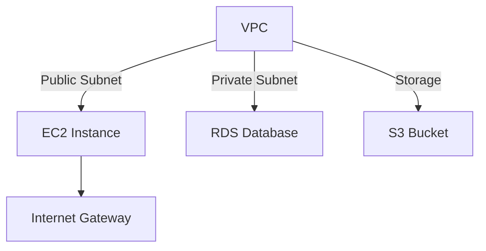

import ProjectCard from './components/ProjectCard';
import FeatureHighlight from './components/FeatureHighlight';
import Image from 'next/image';

# 🌟 Welcome to **Brian's AWS Projects Portfolio**  

> Explore a showcase of cloud-powered innovations that leverage the full potential of AWS technologies. These projects are designed with scalability, efficiency, and modern architecture principles in mind. 

---

## **🚀 Overview**

This portfolio highlights projects I've built utilizing AWS services, showcasing creativity, technical depth, and problem-solving. From infrastructure automation to web applications, explore how AWS transforms ideas into scalable solutions. 

---

## **🗂 Featured Projects**

<ProjectCard
  title="Cloud Hosted Static Website"
  description="A lightweight static website hosted on Amazon S3 with seamless routing and error handling. Configured for public access and blazing-fast delivery via CloudFront."
  imagePath="/images/projects/static-website.jpg"
  link="/projects/static-website"
/>

<ProjectCard
  title="Scalable Web App Hosting"
  description="A scalable full-stack web application hosted on an EC2 instance. The architecture leverages VPC, subnets, and auto-scaling groups for high availability."
  imagePath="/images/projects/scalable-web-app.jpg"
  link="/projects/scalable-web-app"
/>

<ProjectCard
  title="Secure Data Backup Solution"
  description="An S3 bucket integrated with lifecycle policies for automatic backups and secure storage, ensuring compliance and durability."
  imagePath="/images/projects/data-backup.jpg"
  link="/projects/data-backup"
/>

---

## **🔧 Infrastructure at a Glance**

> **Key Features:** 
> - **VPC Design:** Organized with both public and private subnets for security.
> - **Compute Power:** EC2 instances hosting full-stack apps with auto-scaling.
> - **Resilient Storage:** S3 buckets for hosting static content and secure backups.
> - **Database Layer:** Secure and scalable RDS for relational data.

---

## **🌈 Project Highlights**

### 1. **Static Website Hosting with Amazon S3**

- **Description:** A responsive static website hosted on S3 with public-read access. Configured for custom error pages and versioning.
- **Tools Used:**
  - Amazon S3 (Static Hosting)
  - CloudFront (CDN Integration)
- **Key Learnings:**
  - Efficient storage with lifecycle policies
  - Hands-on experience with hosting configurations

---

### 2. **Scalable Full-Stack Application**

- **Description:** This project demonstrates deploying a scalable web application using EC2 instances and a custom VPC.
- **Architecture:**
  - Public subnets for front-end services
  - Private subnets for database storage
  - Security groups to control access
- **Key Tools:**
  - EC2, VPC, Auto-Scaling
  - Load Balancers for fault tolerance

---

### 3. **S3 Backup Solution**

- **Description:** An automated data backup pipeline leveraging AWS S3 with lifecycle rules to minimize costs.
- **Features:**
  - Archival using S3 Glacier
  - Cross-region replication for disaster recovery
- **Outcome:** Highly durable, cost-efficient backups for critical data.

---

## **🎯 Why AWS?**

AWS provides unparalleled scalability, security, and innovation opportunities for developers. By leveraging services like EC2, S3, and VPC, I've been able to:

- Build resilient architectures
- Optimize performance for global delivery
- Simplify deployments with IaC (Infrastructure as Code)

---

## **📈 Growth & Future Plans**

- **Enhanced Monitoring:** Integrating CloudWatch for real-time insights.
- **Advanced Security:** Adopting IAM best practices and encrypting data at rest.
- **Serverless:** Exploring Lambda for event-driven workloads.

Stay tuned for more updates! 🚀

---

## **📬 Contact Me**

Have questions about these projects or looking to collaborate? Feel free to reach out:

- **Email:** [briankimemia@gmail.com](mailto:briankimemia@gmail.com)
- **Portfolio:** [briankimemia.vercel.app](https://briankimemia.vercel.app)
- **GitHub:** [BrianKN019](https://github.com/BrianKN019)

---

