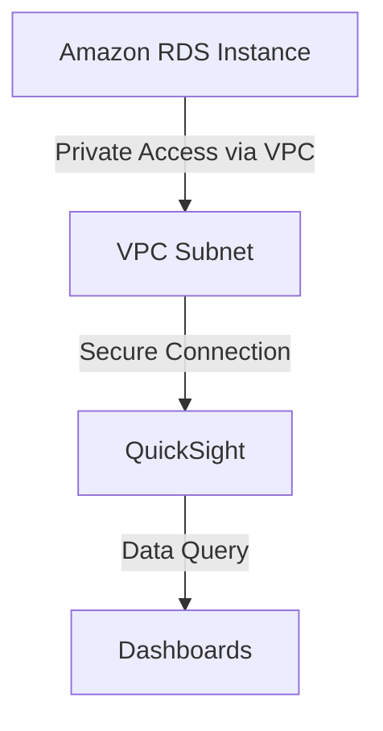
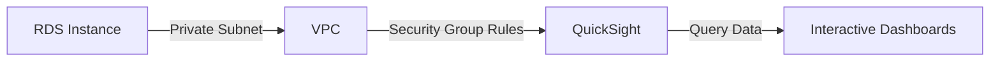
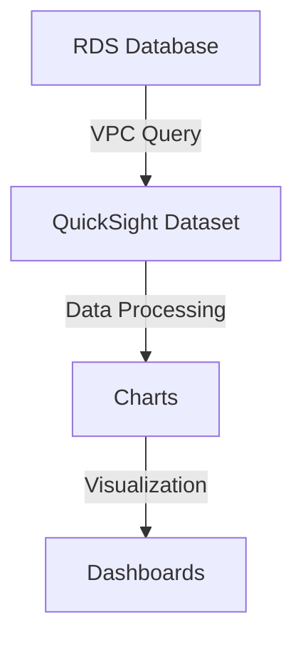

# 🌟 Legendary AWS RDS and QuickSight Connectivity Project 🌟

Welcome to the **Legendary AWS RDS and QuickSight Connectivity Project**, where we explore how to securely connect Amazon RDS to AWS QuickSight for powerful data visualization. This project demonstrates best practices for securing databases, configuring network settings, and creating stunning dashboards to visualize insights.

---

## 🏆 Objectives

- 🔒 **Securely configure Amazon RDS** for private and controlled access.
- 🌐 **Establish connectivity** between RDS and QuickSight via VPC.
- 📊 **Leverage QuickSight** to build insightful dashboards from RDS data.
- 🚀 **Optimize security and performance** for cloud-based databases and analytics.

---

## 📖 Key Concepts

### What is Amazon RDS?
Amazon RDS (Relational Database Service) is a fully managed AWS service that simplifies database setup, scaling, backups, and security. It supports engines like MySQL, PostgreSQL, and SQL Server.

### What is AWS QuickSight?
AWS QuickSight is a cloud-native business intelligence service that enables you to create interactive dashboards and visualizations from various data sources, including RDS.

---

## 🏗️ Architecture Overview

Here’s the architecture implemented for this project:

---

## 🛠️ Step-by-Step Implementation

### 1️⃣ **Create and Configure RDS**
1. **Launch RDS Instance**:
   - Selected MySQL as the database engine.
   - Used a private VPC subnet for isolation.
   - Configured the database name, admin username, and password.
2. **Secure the Instance**:
   - Disabled public access.
   - Created an RDS-specific security group (`RDS_SecGp`).
   - Configured inbound rules to allow QuickSight access via its security group (`QuickSight_SecGp`).

### 2️⃣ **Connect QuickSight to RDS**
1. **Configure VPC in QuickSight**:
   - Added a VPC connection in QuickSight with the appropriate VPC and subnets.
   - Attached the QuickSight security group to the connection.
2. **Create Data Source**:
   - Selected RDS as the data source in QuickSight.
   - Validated the connection using the RDS credentials.
   - Imported the database schema for visualization.

### 3️⃣ **Build Dashboards**
1. Used imported RDS tables to create charts and graphs.
2. Designed interactive dashboards with filters and drill-down features.

---

## 🔐 Security Configuration Workflow

### Key Security Steps:
- Created a **custom security group** for RDS.
- Allowed QuickSight's security group to query the RDS instance.
- Ensured all traffic is within the private VPC subnet.

---

## 🎨 Data Visualization Workflow

- **Dataset Creation**: Imported the `newhire` and `department` tables from RDS.
- **Chart Types**: Included bar charts, line graphs, and pie charts to represent employee and department data.
- **Dashboard Features**: Added filters, date ranges, and drill-down options for detailed insights.

---

## 🌟 Highlights and Learnings

### 🏆 Achievements:
- Established secure communication between RDS and QuickSight.
- Built interactive dashboards for data analysis.
- Learned to configure and troubleshoot VPC connectivity.

### 💡 Key Takeaways:
- **Security Groups** and **Network ACLs** are critical for controlled access.
- VPC configurations ensure private and secure data handling.
- QuickSight simplifies data visualization with powerful interactive tools.

---

## 🚀 Future Enhancements

🔮 **Automated Data Sync**: Implement regular syncing between RDS and QuickSight.  
🔮 **Advanced Analytics**: Integrate machine learning for predictive insights.  
🔮 **Role-Based Access**: Add granular access controls for multi-user environments.

---

## 📸 Illustrations

---

## 📧 Contact

For questions or feedback, reach out:  
📨 Email: [briannkimemia@gmail.com](mailto:briannkimemia@gmail.com)  
🌐 Portfolio: [Brian Kimemia](https://briankimemia.vercel.app)  
**GitHub:** [BrianKN019](https://github.com/BrianKN019)
---

**Thank you for exploring this project! Let’s innovate and build secure AWS solutions together. 🚀**
