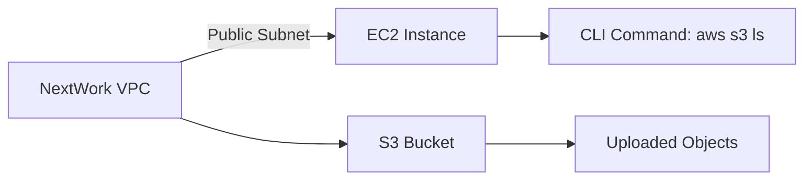

import Image from 'next/image';

# Access S3 from a VPC 🚀

Connecting **Amazon S3** with **Amazon VPC (Virtual Private Cloud)** enables secure and scalable interactions between your resources. This guide walks you through creating a seamless connection between S3 and VPC while ensuring top-tier security and accessibility.

<Image src="../assets/aws-vpc-banner.png" alt="AWS VPC to S3" width={800} height={400} />

---

## 🌟 What You'll Achieve

- Set up a **VPC** with public subnets.
- Launch an **EC2 instance** inside the VPC.
- Configure **AWS CLI** to connect to and manage S3 buckets.
- Upload, retrieve, and list objects in your S3 bucket securely.

---

## 🛠️ Project Architecture

### Overview

Below is the visual representation of the architecture for accessing **Amazon S3** securely from within a **VPC**:



---

## 🚧 Step-by-Step Instructions

### Step 1: Create a VPC

1. **Name Your VPC**: Name it `NextWork`.
2. **Add Subnets**:
   - Create **one public subnet** in the desired availability zone.
3. **Enable Internet Access**:
   - Attach an **Internet Gateway** to your VPC.
   - Update the route table to send internet traffic to the gateway.

<Image src="../assets/vpc-setup.png" alt="VPC Setup" width={800} height={400} />

---

### Step 2: Launch an EC2 Instance

1. Select **Amazon Linux 2** as your base image.
2. Place the instance in the **public subnet** of your VPC.
3. Enable **SSH access** by configuring a security group to allow port 22.
4. Assign a **public IP** to the instance for remote access.

<Image src="../assets/ec2-setup.png" alt="EC2 Instance Setup" width={800} height={400} />

---

### Step 3: Configure AWS CLI on EC2

1. **Install AWS CLI**:
   ```bash
   sudo yum install aws-cli -y
   ```
2. **Authenticate**:
   ```bash
   aws configure
   ```
   Provide:
   - Access Key ID
   - Secret Access Key
   - Default region

---

### Step 4: Create an S3 Bucket

1. Navigate to the **S3 Console** and create a bucket named `nextwork-vpc-project-brian`.
2. Disable public access and enable versioning for enhanced data management.

<Image src="../assets/s3-bucket.png" alt="S3 Bucket Creation" width={800} height={400} />

---

### Step 5: Access S3 from EC2

1. **List all S3 Buckets**:
   ```bash
   aws s3 ls
   ```
2. **Upload a File to S3**:
   ```bash
   echo "Hello from VPC" > test.txt
   aws s3 cp test.txt s3://nextwork-vpc-project-brian
   ```
3. **Verify the Upload**:
   ```bash
   aws s3 ls s3://nextwork-vpc-project-brian
   ```

<Image src="../assets/s3-cli.png" alt="S3 CLI Commands" width={800} height={400} />

---

## 🔒 Enhancing Security

### Use IAM Roles
Avoid hardcoding credentials! Attach an **IAM role** to your EC2 instance to grant it permissions to access S3 securely.

<Image src="../assets/iam-role.png" alt="IAM Role" width={800} height={400} />

---

## 🌟 Key Takeaways

- VPC provides a secure environment for your resources.
- AWS CLI simplifies interactions with S3 from EC2 instances.
- Use IAM roles for secure and scalable authentication.

---

## 🚀 Next Steps

- Explore **VPC endpoints** for direct, private connectivity to S3.
- Set up **CloudWatch Logs** for monitoring access patterns and auditing activity.

---

<Image src="../assets/aws-logo.png" alt="AWS Logo" width={200} height={200} />

**Ready to level up your AWS skills? Dive into more projects like this!**
