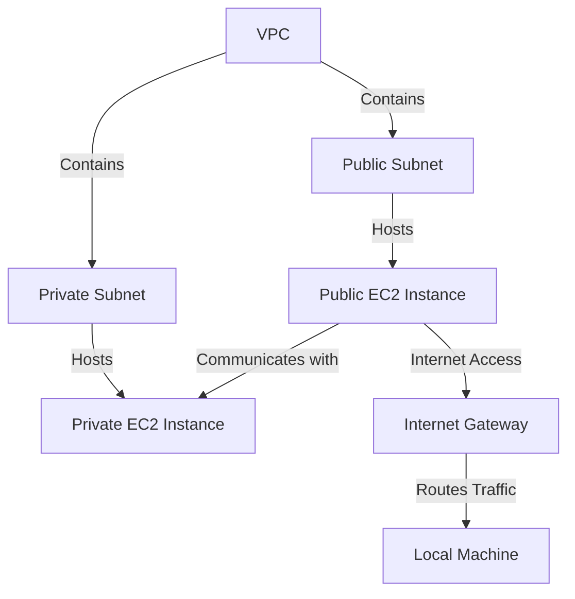
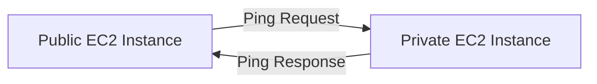

# 🌐 Legendary AWS VPC Connectivity Project 🌐

Welcome to the **Legendary AWS VPC Connectivity Project**, where we explore the fundamentals and advanced concepts of **Amazon Virtual Private Cloud (VPC)** to build secure, isolated networks within AWS. This project involves creating and managing public and private EC2 instances, troubleshooting connectivity issues, and configuring secure communication between resources.

---

## 🏆 Objectives

- 🌟 **Learn** how to design and deploy secure networks using Amazon VPC.
- 🔒 **Secure** communication between EC2 instances.
- 🌐 **Test and verify** network connectivity using tools like `ping` and `curl`.
- 🔧 **Troubleshoot** connectivity issues and resolve misconfigurations.

---

## 🎯 Key Concepts

### What is Amazon VPC?
Amazon VPC (Virtual Private Cloud) allows you to create private, isolated networks within AWS. It provides full control over network configurations, traffic routing, and security.

### Why Amazon VPC?
- **Security**: Isolate resources within private networks.
- **Flexibility**: Customize IP ranges, subnets, and routing.
- **Connectivity**: Enable communication between private and public resources.

### Key Terms:
| **Term**         | **Description**                                                                 |
|------------------|-------------------------------------------------------------------------------|
| **Subnet**       | A range of IP addresses within a VPC. Can be public or private.               |
| **Route Table**  | Determines where network traffic is directed within a VPC.                   |
| **Security Group** | A virtual firewall controlling inbound and outbound traffic for instances.   |
| **Network ACL**  | A layer of security that acts as a firewall for subnets.                     |
| **Internet Gateway** | Enables resources in a VPC to connect to the internet.                    |

---

## 🏗️ Architecture Overview

Here’s the architecture we implemented for this project:



---

## 🛠️ Step-by-Step Implementation

### 1️⃣ **Set Up the VPC**
1. Created a VPC with the following CIDR block: `10.0.0.0/16`.
2. Added two subnets:
   - **Public Subnet**: `10.0.1.0/24`
   - **Private Subnet**: `10.0.2.0/24`
3. Attached an **Internet Gateway** to the VPC for internet access.
4. Configured **route tables**:
   - Public subnet route table directs `0.0.0.0/0` traffic to the Internet Gateway.
   - Private subnet route table directs traffic to a NAT Gateway.

### 2️⃣ **Launch EC2 Instances**
- **Public EC2 Instance**: Deployed in the public subnet for testing external connectivity.
- **Private EC2 Instance**: Deployed in the private subnet for internal communication.

### 3️⃣ **Configure Security**
- Created a **Security Group** for each instance:
  - Public EC2: Allowed inbound SSH (port 22) and HTTP (port 80) traffic.
  - Private EC2: Allowed inbound ICMP (ping) from the public subnet.
- Configured **Network ACLs** to allow traffic between subnets.

---

## 🔄 Testing Connectivity

### EC2 Instance Connect
- Used **EC2 Instance Connect** to securely SSH into the public EC2 instance.
- Updated inbound rules to allow SSH traffic from `Anywhere-IPv4`.

### Ping Between Instances
- Ran `ping 10.0.2.100` from the public EC2 instance to the private EC2 instance.
- Initially failed due to missing ICMP rules but succeeded after updating security group and Network ACL rules.



### Curl to Test HTTP
- Verified web server connectivity using:
  ```bash
  curl http://10.0.1.231
  ```
- Successfully returned an HTTP response from the private EC2 instance.

---

## 🎨 Ping vs Curl

| **Tool** | **Purpose**                                           | **Example Command**     |
|----------|-------------------------------------------------------|--------------------------|
| **Ping** | Tests basic network connectivity using ICMP packets.  | `ping 10.0.2.100`       |
| **Curl** | Sends HTTP requests to check server responses.         | `curl http://10.0.1.231` |

---

## 📊 Key Takeaways

- **VPC Design**: Proper configuration of subnets, route tables, and gateways ensures secure and efficient networking.
- **Security Management**: Both **Security Groups** and **Network ACLs** are essential for managing traffic.
- **Troubleshooting**: Testing connectivity with tools like `ping` and `curl` helps identify misconfigurations.

---

## 🚀 Future Enhancements

🔮 **Multi-VPC Peering**: Establish communication between multiple VPCs.  
🔮 **Advanced Monitoring**: Use CloudWatch to monitor traffic and security events.  
🔮 **Automated Deployments**: Implement Terraform or AWS CloudFormation for infrastructure as code.

---

## 📸 Illustrations


---

## 📧 Contact

For questions or feedback, reach out:  
📨 Email: [briannkimemia@gmail.com](mailto:briannkimemia@gmail.com)  
🌐 Portfolio: [Brian Kimemia](https://briankimemia.vercel.app)  
**GitHub:** [BrianKN019](https://github.com/BrianKN019)
---

**Thank you for exploring this project! Let’s innovate and build secure AWS networks together. 🚀**
